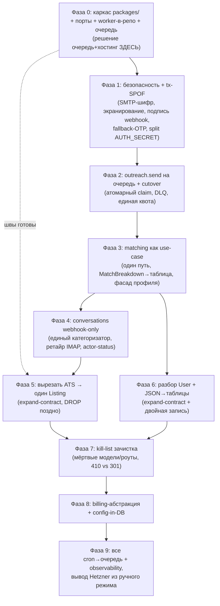

# Freelanly — Целевая архитектура (blueprint для переписывания)

> **Это дизайн-документ, не план правок.** Описывает целевое состояние («как должно быть») для подготовки к переписыванию, охват — весь продукт. Конкретные диффы — на этапе исполнения каждой фазы.

## Refinement notes — что выверено по коду (2026-06-02)

Все ключевые утверждения проверены против реального репозитория. Подтверждено: 54 Prisma-модели; `auto-apply-processor.ts` = **1394** строки; `linkedin-posts/route.ts` = **712**; мёртвые провайдеры `src/lib/email/{resend,ses,smtp2go,elasticemail}.ts` (живые — только `postal.ts`+`index.ts`); незарегистрированный дублирующий роут `/api/cron/process-auto-apply` (есть файл, **нет** в `vercel.json`); `reply-checker.ts` — raw IMAP `tls.connect(993)` с 14-дневным окном; `inbound-reply` webhook с **опциональной** подписью; нет `packages/`/`apps/`/`worker/` в репозитории (предлагаемая структура — greenfield).

**Исправления к исходному драфту (внесены ниже):**
1. **`User` — ~85 полей (133 непустых строки), не 143.** Всё равно god-model, но число завышено — поправлено.
2. **Каноническая сущность Outreach — `AutoApplication`** (116 ссылок в коде), а legacy `Application` (3 ссылки, job-board) идёт в kill-list. Драфт называл новую сущность `Application` — коллизия с существующей таблицей. Везде используем `AutoApplication`.
3. **`AutoApplication.status` — это enum `AutoModeStatus`/`AutoApplyStatus`, НЕ свободный `String`** (12 значений: PENDING, REVIEW, SENDING, SENT, DELIVERED, OPENED, REPLIED, INTERVIEW, OFFER, SKIPPED, REJECTED, FAILED, `@default(PENDING)`). Прошлая формулировка §5.5 «свободный String» была неверна — поправлено. Следствие для cutover см. §9-Фаза 2 / §10: «не-терминальное» — это **явное множество** {PENDING, REVIEW, SENDING}, а не одно `SENDING`; enum снимает риск разнобоя написаний, но не риск пропустить `PENDING`/`REVIEW`.
4. **`AutoApplication` несёт `jobId?` + `opportunityId?` как loose `String?` (без `@relation`/FK)** + два idempotency-констрейнта `@@unique([userId, jobId])` и `@@unique([userId, opportunityId])`. Это прямой мост ATS↔Outreach и меняет предусловие Фазы 5 (см. §5.4) — часть **живых** откликов привязана к `Job`, а не к `Opportunity`.
5. **Две находки безопасности** (см. §8): IMAP-клиент в `reply-checker.ts` отключает проверку TLS (`rejectUnauthorized: false`); `recruiter-token.ts` использует `AUTH_SECRET || randomBytes(32)` — тихий random-fallback (следствие для Фазы 1 см. §8).
6. **`consumeApplyQuota`/`refundApplyQuota`/`FREE_DAILY_APPLY_LIMIT=20` уже существуют** в `src/lib/apply-quota.ts` — единый квота-шлюз §7 **переиспользует их**, а не вводит заново (нужно лишь сделать списание атомарным).
7. `vercel.json` уже содержит больше кронов, чем CLAUDE.md (`hot-lead-reminders`, `generate-cvs`) — подтверждает разрастание кронов, которое §9-Фаза 9 сводит в очередь.

---

## Context

Продукт развернулся из SEO job-board в **AI auto-apply платформу для фрилансеров** с растущей **demand-side** (рекрутерский портал `/r` + монетизация доступа к «отвечающему» пулу кандидатов). Поток: скрап постов → AI-матчинг кандидата под вакансию → AI-генерация cover letter → отправка рекрутеру через Postal → приём и классификация ответа → портал рекрутера.

Код вырос органически через пивот и несёт серьёзный архитектурный долг:

- **54 Prisma-модели**, ~10–12 мёртвые (SEO job-board: `Company`, `LandingPage`, `Application`(legacy), `JobAlert`/`AlertLanguagePair`/`AlertNotification`, `SavedFeed`, `ImportTask`…).
- **God-models**: `User` (~85 полей); `Job` и `Opportunity` — две почти одинаковые модели листинга (`AutoApplication` несёт оба FK: `jobId?`+`opportunityId?`).
- **God-files**: `auto-apply-processor.ts` (1394 строки: матчинг+очередь+отправка+follow-up+квоты), `linkedin-posts/route.ts` (712 строк), ATS-процессоры (`src/services/sources/*`).
- **Overloaded JSON-колонки** без схемы: `User.parsedProfile`, `AutoApplication.matchBreakdown`, `ActivityLog.details`, `Settings.value`.
- **Split-brain рантайм**: движок auto-apply (`match`/`send`/`replies`/`inbound`/`recap`) крутится **вне репозитория** на одном Hetzner-хосте (`/opt/worker`, `tsx` на исходниках, деплой недокументирован), плюс в коде есть незарегистрированный дублирующий `/api/cron/process-auto-apply`. Нет атомарного захвата очереди → риск дабл-сендов. Параллельно живут **два apply-пути**: `auto-apply-processor.ts` и `/api/user/quick-apply/route.ts`.
- **SPOF**: Postal (вся почта — outreach, OTP, ответы), один Hetzner-воркер, единый `AUTH_SECRET` на три назначения (юзер-сессии + рекрутер-токены + unsubscribe).
- **Два расходящихся reply-категоризатора**: `reply-checker.ts` (IMAP-поллинг) vs `inbound-reply` (webhook). IMAP мис-атрибутит ответы и не масштабируется (O(users)×TLS×14d-история), к тому же отключает валидацию сертификата.
- **Безопасность**: SMTP-пароли в plaintext (`UserSmtp`), тело/subject письма не экранируются, inbound-webhook без подписи если `POSTAL_WEBHOOK_SECRET` не задан, IMAP `rejectUnauthorized:false`, рекрутер-токены без секрета и без ротации.
- **Мёртвые ссылки** на удалённые `/jobs`,`/company`,`/country` (по компонентам: `JobCard.tsx`, `OpportunityCard.tsx`, `CrossSellExitPopup.tsx`…); мёртвые email-провайдеры (resend/ses/smtp2go/elasticemail) всё ещё в `src/lib/email/`.

**Решения по развилкам (зафиксированы пользователем):**
- Результат = **целевая архитектура**, охват = **весь продукт**, цель = **подготовка к переписыванию**.
- Стек — **открыт к смене**. Миграция — **strangler-fig** (БД и прод живые, ~5.7k юзеров и активные лупы не теряем).
- **Источник вакансий — ТОЛЬКО посты LinkedIn. Весь ATS (Lever/Greenhouse/Ashby/SmartRecruiters/Workable) вырезается целиком**: модель `Job`, процессоры, discovery, `DataSource`, `Company` — удаляются. Остаётся один тип листинга.

---

## 1. Руководящие принципы

1. **Bounded contexts, а не россыпь файлов.** Код организован по доменам (Ingestion, Profiles, Matching, Outreach, Conversations, Recruiter, Billing, Analytics, Content, Notifications), не по техническому слою. У каждого домена — публичный service-API и приватная внутрянка.
2. **Postgres — система-источник правды; strangler-fig вокруг неё.** Любая смена стека делается «рядом» с той же БД, модуль за модулем. Big-bang исключён.
3. **Чистые слои внутри домена:** `domain` (бизнес-правила, чистые функции) → `application` (use-cases, оркестрация) → `infra` (Prisma, внешние API, очередь) → `interface` (Next.js routes, worker handlers). Зависимости только внутрь.
4. **Долгие задачи — durable-очередь + отдельный worker-сервис**, не off-repo cron-хак. Очередь — часть кодовой базы: идемпотентная, с атомарным захватом и dead-letter.
5. **Внешние сервисы — за портами.** Email, AI, scraping, payments — абстракции, подменяемые и тестируемые. Никаких хардкод-ключей.
6. **JSON — только для реально динамичных данных.** Всё со стабильной формой — нормализованные таблицы или Zod-валидируемые типизированные блобы.
7. **Один путь на операцию.** Один матчер, один reply-категоризатор, один send-pipeline, один payment-интерфейс. Конец расхождению «quick-apply vs processor», «IMAP vs webhook».
8. **Observability и идемпотентность встроены, не доклеены.** Структурные логи с correlation-id, метрики, idempotency-keys, явные status-машины.
9. **ИИ — только там, где надо понять смысл свободного текста.** Всё детерминированное (правила, фильтры, очереди, квоты, статусы) — обычным кодом.

---

## 2. Целевой стек и топология

Рекомендация (учитывая «открыт к смене» + strangler-fig + solo/малая команда): **модульный монолит на TypeScript с выделенным worker-сервисом и durable-очередью**, общая БД.

```
┌────────────────────────────────────────────────────────┐
│  WEB (Next.js App Router, Vercel)                        │
│  - публичные: /freelance, blog, marketing                │
│  - /dashboard (кандидат), /r (рекрутер), /admin          │
│  - тонкие API-routes: только I/O + вызов application-слоя │
└───────────────┬────────────────────────────────────────┘
                │  (общие пакеты domain/application — монорепо)
┌───────────────┴────────────────────────────────────────┐
│  CORE (TS-пакеты):                                       │
│   packages/domain      — бизнес-правила, status-машины   │
│   packages/application — use-cases (matching, outreach…) │
│   packages/infra       — Prisma, порты: tx-email,        │
│                          outreach-email, ai, queue, scrape│
└───────────────┬────────────────────────────────────────┘
                │
┌───────────────┴───────────────┐   ┌──────────────────────┐
│ WORKER (long-running, НЕ Vercel│   │ QUEUE (durable)       │
│  — отдельно от старого /opt)    │◄──┤ pg-boss/pgmq | SQS    │
│  consumers: ingest, match,      │   │ (atomic claim, DLQ)   │
│  send, follow-up, reply,        │   └──────────────────────┘
│  recap, cv-generate             │
│  в репозитории, CI-деплой       │
└───────────────┬────────────────┘
                │
   ┌────────────┼──────────────┬───────────────┐
   ▼            ▼              ▼               ▼
┌────────┐ ┌───────────┐ ┌──────────────┐ ┌──────────┐
│Postgres│ │ Tx-email  │ │ Outreach-    │ │ AI (port)│
│ (Neon) │ │ (OTP/notif│ │ email        │ │ Z.ai /   │
│ truth  │ │ +fallback)│ │ (Postal,     │ │ OpenAI   │
│        │ │           │ │  прогретый   │ │ switch   │
└────────┘ └───────────┘ │  домен)      │ └──────────┘
                         └──────────────┘
```

**Ключевые сдвиги от текущего:**
- **Worker — в репозитории, деплой через CI**, не ручной `scp` на `/opt/worker`. Новый worker разворачивается **физически отдельно** от старого `/opt/worker` (другой хост / изолированный доступ к Postal) — предусловие безопасного cutover (§9, Фаза 2).
- **Durable-очередь** заменяет `findMany(PENDING)+update` из `auto-apply-processor.ts`: атомарный захват, ретраи, DLQ. ⚠️ **Очередь и хостинг worker’а — связанное решение.** `pg-boss`/`pgmq` держат постоянный polling-коннект, а Neon с autosuspend/scale-to-zero это ломает. Варианты: (а) отдельный always-on Postgres под очередь, (б) Neon-ветка без autosuspend, (в) SQS. Решать **рано — к Фазе 2, не к Фазе 9**.
- **Vercel-cron’ы становятся триггерами**, кладущими задачу в очередь; вся работа — в worker. Конец 300s-лимитам и split-brain. (Сейчас в `vercel.json` 9 кронов, включая `hot-lead-reminders`, `generate-cvs`.)
- **Два раздельных email-порта** (transactional vs outreach — см. §8), а не один с fallback.
- `application`/`domain` не зависят от Next.js → backend выносится в standalone без переписывания логики.

> Минимальный вариант (если смена стека нежелательна): остаёмся на Next.js, но вводим (а) durable-очередь, (б) worker в репозитории, (в) слоистые пакеты. Топология та же, риск ниже.

---

## 3. Декомпозиция на bounded contexts

| Домен | Ответственность | Главные сущности |
|---|---|---|
| **Ingestion** | Скрап → нормализация → дедуп → фильтр → один `Listing`. **Только LinkedIn (Apify/n8n).** | `Listing`, `KeywordRun`, `RejectedListing` |
| **Profiles** | Кандидат: резюме→профиль, LinkedIn-обогащение, CV-генерация, навыки/языки/локация. | `User`(auth-only), `CandidateProfile`, `Resume` |
| **Matching** | Гейты профессии/языка/локации/seniority + скоринг; fairness/cap/quota; постановка в очередь. **Один матчер.** | `AutoApplyLoop`, `MatchDecision`, `MatchBreakdown` |
| **Outreach** | Cover letter, attach CV, отправка через outreach-port, status-машина, follow-up. Идемпотентно. | **`AutoApplication`** (каноническая), `OutreachEvent` |
| **Conversations** | Inbound-ответы (только webhook), единый категоризатор, тред, нотификации. | `Message`, `ReplyClassification` |
| **Recruiter/Demand** | Портал `/r`, токен/OTP-сессия, contact-reveal (paywall), suppression/unsubscribe. | `Recruiter`, `ContactReveal`, `RecruiterSuppression` |
| **Billing** | Подписки/платежи за один интерфейс (Stripe+PayPro адаптеры), квоты, paywall-enforcement. | `Subscription`, `Entitlement`, `RevenueEvent` |
| **Analytics** | Event-log, воронки, KPI, CEO-алерты. | `ActivityEvent`, `DailyMetric` |
| **Content/SEO** | Блог, sitemap, indexing, content-quality. | `BlogPost`, `IndexingLog` |
| **Notifications** | Кросс-канальная доставка (email/TG/Slack) — общий сервис. | — |

**Правило межсервисного общения:** домен ходит в другой домен **только через его application-сервис**, не в чужие таблицы.

---

## 4. Runtime-флоу: что происходит и где код/ИИ

🔵 = обычный код (правила, движение данных), 🟣 = ИИ (понимание текста).

| # | Что происходит | Технически | Код/ИИ |
|---|---|---|---|
| 1 | Появляется вакансия — скрап постов **только из LinkedIn** | Apify/n8n → событие `ingest.listing` в очередь | 🔵 |
| 2 | «Это вообще вакансия?» — отсев вебинаров, новостей, «ищу работу», саморекламы | LLM-проверка (`isJobPosting` в `src/lib/ai.ts`) | 🟣 |
| 3 | Достаём суть: должность, навыки, зарплата, язык, email/ссылка, локация | LLM-извлечение полей | 🟣 |
| 4 | Чистим и проверяем: нормализация email, чёрные списки, дедуп | Регэкспы, списки, `sourceId`+fuzzy | 🔵 |
| 5 | Оценка качества (SEO: индексировать/нет) | `src/lib/content-quality.ts`, формула | 🔵 |
| 6 | Сохраняем как `Listing`, кладём событие «новый listing» | INSERT + enqueue | 🔵 |
| 7 | Грубый отсев кандидатов из тысяч лупов | Сравнение слов/навыков лупа (без ИИ) | 🔵 |
| 8 | Справедливая очередь: слоты — сначала тем, кто давно не слал | least-served-first + cap’ы | 🔵 |
| 9 | Точный матчинг: профессия/язык/локация/уровень + балл | LLM с жёсткими гейтами, пачками | 🟣 |
| 10 | Пишем cover letter (рандомный стиль/длина) + subject | LLM | 🟣 |
| 11 | Прикрепляем CV (реальный PDF или сгенерированный) | Сборка PDF, Blob | 🔵 |
| 12 | Ставим в очередь `AutoApplication=PENDING` | INSERT + enqueue | 🔵 |
| 13 | Отправляем: атомарный claim, списание квоты, Postal | claim + `consumeApplyQuota` + SMTP + экранирование | 🔵 |
| 14 | Подмена адреса: отправитель `apply@`, ответ на `reply+{id}@` | Переписывание заголовков | 🔵 |
| 15 | Рекрутер отвечает — письмо через webhook | `inbound-reply`, проверка подписи, привязка по id | 🔵 |
| 16 | «Что за ответ?» — INTERVIEW/INTERESTED/REJECTION/SPAM/OTHER | LLM классифицирует + summary | 🟣 |
| 17 | Обновляем статус и уведомляем (hot-lead → email+TG+Slack; отказ → тихо) | Status-машина + нотификации | 🔵 |
| 18 | Follow-up: через N дней тишины — одно напоминание | таймер + LLM-текст | 🔵/🟣 |
| **Сторона рекрутера** | | | |
| 19 | Открывает `/r` — откликнувшиеся, по совпадению | Токен/сессия, выборка по email | 🔵 |
| 20 | Видит «почему подходит» — разбивка навыков | замороженный `MatchBreakdown` (шаг 9) | 🔵 |
| 21 | Раскрывает контакт / отвечает (первый бесплатно, дальше paywall) | reveal, entitlement, биллинг | 🔵 |
| 22 | Регистрируется при первом ответе | запись `Recruiter` | 🔵 |

**ИИ ровно в 5 точках:** (2) это джоба?, (3) извлечение, (9) матчинг, (10) cover letter, (16) классификация. Всё остальное — детерминированный код.

---

## 5. Целевая модель данных

### 5.1 Единственный листинг (только LinkedIn)
ATS вырезается, остаётся **один `Listing`** (бывш. `Opportunity`, можно переименовать) — **без дискриминатора**. Последствия:
- Ingestion — один путь `LinkedIn(Apify/n8n) → Listing`.
- **Dedup:** первичный — `sourceId` (id поста), partial-unique `WHERE sourceId IS NOT NULL`; fuzzy (clientLinkedIn + title-hash, окно 10 дней) — вторичный слой. ⚠️ **Граница null-sourceId — решить ДО Фазы 5:** partial-unique допускает null; надо знать, всегда ли Apify отдаёт id поста. Если бывает null — такие записи дедупятся только через fuzzy-окно. Снять распределение `sourceId`/URL на проде перед constraint’ом (skill `db-query`).
- Матчинг/фильтры работают только с неструктурированным текстом постов — подтвердить, что это и есть фактическое поведение (предусловие Фазы 5).
- **`KeywordRun`** — единственная ingestion-tracking-сущность после выреза ATS: фиксирует прогон LinkedIn-keyword-скрапа. Заменяет ATS-овые `ImportLog`/`ImportTask`/`DataSource`, которые удаляются.

### 5.2 Разбор `User` god-model (~85 полей)
- `User` — только identity/auth (email, OAuth, session-связи, флаги верификации).
- `CandidateProfile` — **нормализованные** `skills`, `languages`, `experienceYears`, `currentTitle`, `field`, `location`, `workPreference`, `bookingUrl`, `portfolioUrl`.
- `Subscription`/`Entitlement` — план, провайдер, лимиты, период.
- `EmailCampaignState` — все `*EmailsSent`/`*SentAt`/nurture-трекеры (сейчас разбросаны по `User` + моделям `TrialEmail`/`WinbackEmail`/`ReengagementEmail`/`AbandonedCheckoutEmail`).
- `NotificationPrefs` — TG/Slack/каналы.

### 5.3 JSON → таблицы / типизация
- `User.parsedProfile` → нормализованные поля `CandidateProfile` (+ опц. `rawProfile`, Zod).
- `AutoApplication.matchBreakdown` → таблица `MatchBreakdown` (matched/total/ratio/lines) **с версией алгоритма** — аудит-трейл остаётся интерпретируем после смены матчера. (Поле уже несёт `{matched,total,wouldGate,bucket,lines}` и используется в shadow/gate/render — нормализуем без потери семантики.)
- `ActivityLog.details` → дискриминированный union по `action` (Zod per action).
- `Settings.value` → типизированные key-схемы.

### 5.4 Kill-list
**Весь ATS-стек:** `Job` + `ImportedJob`; процессоры `src/services/sources/*` + `filters`; discovery-кроны/вебхуки (`discover-lever`, `discover-greenhouse`, `run-lever-discovery`…); `DataSource`, `ImportLog`, `ImportTask`, `FilteredJob`; `/api/cron/fetch-sources`; `Company` (нужна была только под ATS — LinkedIn-клиент в полях `Listing`).
**Job-board наследие:** `LandingPage`, **legacy `Application`** (3 ссылки → слить семантику в `AutoApplication`), `JobAlert`+`AlertLanguagePair`+`AlertNotification`+`AlertEmailFeedback` (алерты приостановлены), `SavedFeed` (дубль `AutoApplyLoop`), `VideoPostQueue` — по факту использования.
**Email-провайдеры:** удалить `src/lib/email/{resend,ses,smtp2go,elasticemail}.ts` + их мёртвые вебхуки.
Каждое удаление — отдельная strangler-миграция с архивом; ATS-удаление даёт самое большое сокращение поверхности.

> ⚠️ **`Job` — НЕ чистое мёртвое удаление: живая `AutoApplication` ссылается на него.** `AutoApplication.jobId` — loose `String?` **без `@relation`/FK** (так что DROP `Job` не упадёт на DB-уровне — осиротение чисто логическое, констрейнт не защитит, нужна data-проверка), и часть **реальных, не-legacy** откликов привязана к `Job`-листингу, а не к `Opportunity`. Это меняет оценку риска Фазы 5 с «в основном удаление» на **«зависит от данных»** (симметрично null-sourceId). Предусловие Фазы 5 — снять на проде долю `AutoApplication WHERE jobId IS NOT NULL AND opportunityId IS NULL` (отклики, существующие **только** через ATS-листинг). Если доля ненулевая — для этих строк нужна стратегия **до** DROP: либо мигрировать соответствующий `Job`-листинг в `Listing` с сохранением связи (перепривязать `jobId`→`opportunityId`/`listingId`), либо архивировать отклик. См. §9-Фаза 5.

### 5.5 Дисциплина статус-машин
`AutoApplication.status` — **уже enum** (`AutoApplyStatus`, 12 значений, `@default(PENDING)`): PENDING/REVIEW/SENDING/SENT/DELIVERED/OPENED/REPLIED/INTERVIEW/OFFER/SKIPPED/REJECTED/FAILED. Enum есть, но **переходы нигде не формализованы** — любой код может писать любое значение. Задача Фазы 4 — не ввести enum (он есть), а добавить явный автомат переходов в `domain`-слое поверх него. Терминальные: SENT→…→{REPLIED,INTERVIEW,OFFER,REJECTED,FAILED}; промежуточные/«не-терминальные»: {PENDING, REVIEW, SENDING} (REVIEW = semi-auto, ждёт ручного аппрува — **не путать с in-flight-send**). Регресс hot-lead-статусов разграничен **по actor’у**:
- **Авто-путь (reply-классификатор) НЕ может понижать** INTERVIEW/OFFER — закрывает баг «spam-reply сбрасывает hot-lead».
- **Легитимный регресс** (оффер отозвали, кандидат снял отклик) разрешён — **только явным событием с причиной**.
- Правило: переход-понижение требует `actor ∈ {human, admin-event}` + `reason`; у авто-классификатора такого actor’а нет.

---

## 6. Слоистая организация кода

```
packages/
  domain/<context>/        # чистые правила, status-машины, скоринг
  application/<context>/    # use-cases: queueMatches, sendApplication, classifyReply
  infra/
    db/                     # Prisma + репозитории, напр. CandidateProfileRepository
    email-tx/               # TransactionalEmailPort: Postal + fallback-провайдер
    email-outreach/         # OutreachEmailPort: Postal (прогретый домен), деградация=отложить
    ai/                     # AiPort: Zai | OpenAI (через AI_PROVIDER)
    queue/                  # QueuePort: pg-boss/SQS adapter
    scrape/                 # ApifyAdapter (LinkedIn only)
apps/
  web/                      # Next.js: routes = тонкие контроллеры → application
  worker/                   # consumers очереди → application
```

- **Routes и worker-handlers тонкие:** парсинг входа, auth, вызов одного use-case, сериализация.
- **Один матчер-use-case** — и для worker (`match`-consumer), и для inline-apply (`/freelance/[slug]`), и взамен `quick-apply`.
- **Один reply-категоризатор** в `application/conversations` (объединяет логику `reply-checker.ts` и `inbound-reply`).
- **Профиль кандидата — через `CandidateProfileRepository`-фасад**: отдаёт нормализованный профиль независимо от физического хранения. Читатели (матчер) не переписываются при миграции схемы §5.2.

---

## 7. Auto-apply как явный pipeline на очереди

Монолитный `processAutoApplyQueue` (`src/services/auto-apply-processor.ts`) заменяется цепочкой идемпотентных consumer’ов:

```
ingest.listing.created
  └─► match.listing      (gates + score + fairness/cap → MatchDecision[])
        └─► outreach.queue (AutoApplication=PENDING, генерит cover+CV)
              └─► outreach.send    (атомарный claim PENDING→SENDING,
                                    consumeApplyQuota, outreach-port, → SENT, DLQ при фейле)
                    └─► outreach.followup (через N дней без ответа)

inbound.reply (webhook) ─► conversations.classify ─► notify (email/TG/Slack)
recap (cron-trigger)    ─► digest.build         ─► notify
```

Гарантии, которых сейчас нет:
- **Атомарный захват** задачи → нет дабл-сендов (заменяет неатомарный `findMany(PENDING)+update`).
- **Idempotency-key** на (userId, listingId) и на inbound (Message-ID) → нет дублей. На уровне *создания* `AutoApplication` идемпотентность уже частично есть — `@@unique([userId, jobId])` и `@@unique([userId, opportunityId])`; queue-ключ send-задачи должен выводиться из той же identity `(userId, jobId|opportunityId)`, чтобы create-guard и send-guard говорили об одном ключе.
- **DLQ + ретраи** вместо «FAILED навсегда».
- **Квота** — **переиспользуем существующие `consumeApplyQuota`/`refundApplyQuota` из `src/lib/apply-quota.ts`** как единый шлюз перед отправкой; задача — сделать списание атомарным (сейчас счётчик не защищён от гонки между двумя apply-путями).
- **Reply — только webhook** (`reply+{appId}@`); IMAP-поллинг `reply-checker.ts` ретайрится.

---

## 8. Cross-cutting

- **Два РАЗНЫХ email-порта** (не один с fallback — противоположные требования):
  - **`TransactionalEmailPort`** (OTP, reply-нотификации, recap): низкий объём, высокая срочность. Fallback = дешёвый внешний провайдер. Вводится **сразу в Фазе 1** — снимает SPOF на логин.
  - **`OutreachEmailPort`** (отклики рекрутерам): высокий объём с **прогретых доменов**. Fallback ≠ «второй провайдер» (сжигает домен). Правильная деградация при недоступности Postal — **отложить отправку (requeue), а не слать с холодного домена.**
  - Экранирование тела/subject (XSS/header-injection) + проверка List-Unsubscribe/suppression **перед** отправкой — в обоих адаптерах. (Сейчас письма не экранируются.)
- **Секреты:** SMTP-пароли (`UserSmtp`) — шифровать at-rest (KMS/libsodium), не plaintext. Хардкод Logo.dev-токена и пр. — в secret-store. Inbound-webhook — **обязательная** подпись (сейчас `POSTAL_WEBHOOK_SECRET` опционален, при незаданном — no-op). **IMAP `reply-checker.ts` использует `rejectUnauthorized:false`** — при ретайре IMAP проблема уходит, но до этого момента включить валидацию сертификата.
- **Разделение `AUTH_SECRET`:** сейчас один секрет на три назначения — `lib/recruiter-token.ts`, `lib/unsubscribe.ts`, NextAuth-сессии. **Доп. находка:** `recruiter-token.ts` делает `AUTH_SECRET || randomBytes(32)`. Сегодня, скорее всего, проблемы нет — раз сессии работают, `AUTH_SECRET` в проде задан, и fallback не срабатывает. Но это **тихая ловушка ровно в момент разнесения секретов (Фаза 1):** введёшь `RECRUITER_TOKEN_SECRET`, забудешь проставить его в одном окружении (Vercel preview, worker-хост) — и код молча свалится на `randomBytes`, начнёт штамповать токены, не проходящие верификацию в другом окружении. То есть само разнесение станет источником протухших рекрутер-ссылок — того, что эта правка чинит. **Правило: убрать random-fallback на fail-fast (throw при отсутствии секрета) нужно РАНЬШЕ или ОДНОВРЕМЕННО с введением нового секрета, и проверить наличие во всех окружениях (prod, preview, worker).** До любой ротации разнести на `SESSION_SECRET`/`RECRUITER_TOKEN_SECRET`/`UNSUBSCRIBE_SECRET`. После — вводить ротацию/ревокацию рекрутер-токенов (сейчас вечные).
- **Auth:** кандидат — NextAuth v5 (Google + OTP); рекрутер — отдельный токен/OTP-контекст (`RecruiterOtp`) — вынести в `application/recruiter`.
- **Config-in-DB:** `target-professions`, `company-blacklist`, чёрные списки доменов — в таблицы (рантайм без редеплоя) с кэшем.
- **Observability:** структурные JSON-логи с correlation-id через всю очередь; метрики (AI-латентность/ошибки, dedup-hit, send-throughput, reply-rate по cohort’ам); алерты на падение Postal/Apify/AI (skill `health` уже частично это покрывает).
- **Идемпотентность ingestion:** ключ `sourceId` + транзакция вокруг dedup→insert.

---

## 9. Strangler-fig: последовательность перехода

«Сначала развязать, потом резать», без остановки прода. Каждая фаза — отдельный PR-набор, БД живая.



**Фаза 0 — Каркас и швы.** Завести `packages/domain|application|infra` и порты как фасады поверх текущего кода. Подключить durable-очередь. Завести worker в репозитории + CI-деплой. ⚠️ Новый worker **физически отделён** от старого `/opt/worker` и **пока без рабочего `OutreachEmailPort`** (матчит и пишет в БД, но не шлёт). **Решение по очереди+хостингу принимается здесь.**

**Фаза 1 — Безопасность и transactional-SPOF** (низкий риск, высокая ценность; рефактора не ждёт). Шифрование SMTP-паролей; экранирование email (тело+subject); обязательная подпись inbound-webhook; резервный transactional-провайдер для OTP; разнесение `AUTH_SECRET` на три секрета. ⚠️ **Порядок внутри фазы критичен:** убрать random-fallback в `recruiter-token.ts` на fail-fast **раньше/одновременно** с введением `RECRUITER_TOKEN_SECRET`, и подтвердить наличие секрета во **всех** окружениях (prod, Vercel preview, worker-хост) до выката — иначе разнесение само протухит рекрутер-ссылки (§8).

**Фаза 2 — Outreach на очередь + безопасный cutover** (самый опасный момент). Перенести `send` в `outreach.send`-consumer с атомарным claim + DLQ + единой квотой.
- *Риск дабл-сенда — в момент cutover, не в коде.* Split-brain (старый off-repo движок + новый worker) видит одну БД. Атомарный claim не спасает, если старый его не уважает.
- *Shadow безопасен* только потому, что у нового нет `OutreachEmailPort`.
- *Предусловие:* новый worker физически отделён (из Фазы 0).
- **Cutover-протокол:**
  1. **Бэкфилл idempotency-ключей из истории `AutoApplication`** — до включения порта. Ключ выводится из `(userId, jobId|opportunityId)` — той же identity, что уже несут `@@unique`-констрейнты (§7).
  2. **Заглушить ВСЕ старые sender-пути, не только Hetzner.** Известно три: (i) off-repo `/opt/worker` на Hetzner, (ii) незарегистрированный `/api/cron/process-auto-apply`, (iii) `/api/user/quick-apply/route.ts` — **живёт на Vercel, не на Hetzner**, поэтому «стоп Hetzner-процесса» его не касается. Перед включением порта — исчерпывающая инвентаризация всего, что умеет звать Postal напрямую (grep по вызовам Postal-клиента + Vercel-роуты), стоп/отъём доступа по каждому, и лишь затем «подтвердить молчание» — иначе подтвердишь молчание одного источника из трёх.
  3. **Инвентаризация in-flight — по ЯВНОМУ множеству не-терминальных статусов, не по одному `SENDING`.** Статус — enum (§5.5), так что разнобоя написаний нет, но «застрявшие» строки могут быть в любом из {PENDING, REVIEW, SENDING}: старый движок мог не дойти до `SENDING` (оставить `PENDING`) или ждать ручного аппрува (`REVIEW`). Снять фактический набор статусов на проде (skill `db-query`), затем по каждой не-терминальной строке решить (дослать / FAILED / оставить). REVIEW — **не** форсить в FAILED (это легитимное ожидание аппрува, не зависший send).
  4. **Включить `OutreachEmailPort` новому worker.**
- *Откат:* вернуть доступ старому, отозвать порт у нового.

**Фаза 3 — Matching как use-case.** Вынести матчер из `auto-apply-processor.ts` в `application/matching`, один путь для worker, inline-apply и взамен `quick-apply`. `matchBreakdown` → таблица. Профиль читать через `CandidateProfileRepository`-фасад (Фаза 6 меняет только его реализацию).

**Фаза 4 — Conversations webhook-only.** Единый категоризатор, ретайр IMAP (`reply-checker.ts`), status-машина по actor’у (§5.5), idempotency по Message-ID.

**Фаза 5 — Вырезать ATS, свести к одному листингу** (риск — **«зависит от данных»**, не «в основном удаление»). ⚠️ **Два предусловия (симметрично cutover Фазы 2):**
- *(a) Live-читатели:* «матчинг не использует структурные поля ATS» — пока *утверждение*. **Доказать на проде, что ни один live-читатель не зависит от `Job`/`Company`/`DataSource`** (grep + анализ реальных запросов: content-quality, fairness, аналитика, recap).
- *(b) Осиротение откликов:* снять долю `AutoApplication WHERE jobId IS NOT NULL AND opportunityId IS NULL` (skill `db-query`) — это **живые** отклики, существующие только через ATS-листинг. `jobId` — loose `String?` без FK, DROP `Job` не упадёт на DB-уровне, осиротение молчаливое. Если доля ненулевая — стратегия **до** DROP (§5.4): перепривязать `Job`-листинг в `Listing` с сохранением связи, либо архивировать отклик. Без этого «вырез» теряет историю откликов.
  - ⚠️ **Перепривязка меняет identity-ключ, на котором стоит idempotency-гарантия Фазы 2.** Бэкфилл idempotency-таблицы (Фаза 2) сделан по `(userId, jobId|opportunityId)` (§7, §10). Перепривязка `jobId=X → opportunityId/listingId=Y` меняет этот ключ для осиротевших строк: запись начинает жить под новым ключом, но idempotency-таблица всё ещё держит старый → повторный матч того же листинга (уже как `Listing`) не найдёт себя по новому ключу и **породит второй отклик**. То есть Фаза 5 способна ретроактивно пробить идемпотентность Фазы 2. **Инвариант: перепривязка обязана синхронно мигрировать idempotency-ключ (старый→новый, либо оставить старый как алиас), а не только поле `AutoApplication`.** Симметрично «одному ключу» для create-guard/send-guard в §7 — тот же ключ должен пережить миграцию identity.
  - ⚠️ **Data-проверка на unique-коллизию:** `@@unique([userId, jobId])` и `@@unique([userId, opportunityId])` — два раздельных констрейнта. Если юзер откликался на одну и ту же вакансию **и** через ATS-листинг (`jobId`), **и** через нативный Opportunity (`opportunityId`), то после перепривязки пара `(userId, opportunityId)` станет дублем по второму констрейнту и миграция упадёт на unique violation. До перепривязки — снять такие пересечения (skill `db-query`) и решить (merge/skip/архив) в этом же предусловии 5b.

Порядок строго по **expand-contract** (никакого раннего DROP):
1. **Остановить ATS-ingestion**: выключить ATS-кроны/вебхуки/discovery. Новые `Job` не создаются.
2. **Оставить таблицы `Job`/`Company`/… read-only**, удалить только код процессоров/конфигов.
3. **Подтвердить нулевое чтение** этих таблиц на проде в окне наблюдения.
4. **Переименовать `Opportunity`→`Listing`** (опц.), закрепить dedup (§5.1).
5. **DROP `Job`/`Company`/`DataSource`/`ImportLog`/`ImportTask`/`FilteredJob`** — **отдельной поздней миграцией** (ближе к Фазе 7), после паритета и архива.

**Фаза 6 — Разбор `User` + JSON→таблицы.** `CandidateProfile`/`Subscription`/`EmailCampaignState`/`NotificationPrefs`; нормализация parsedProfile; типизация ActivityLog/Settings. Меняет только реализацию `CandidateProfileRepository`. ⚠️ ~5.7k юзеров и лупы читают профиль *во время* перелива — строго **expand-contract + двойная запись + бэкфилл**: добавить таблицы → писать в обе → бэкфиллить фоном → переключить чтение фасада → потом дропнуть старые поля.

**Фаза 7 — Kill-list (зачистка).** Удалить мёртвые модели/роуты/email-провайдеры/битые ссылки `/jobs|/company|/country` (в `JobCard.tsx`, `OpportunityCard.tsx`, `CrossSellExitPopup.tsx` и др.). ⚠️ SEO-трафик завязан на эти URL — решить **410 vs 301** по данным GSC (skill `seo`), обновить sitemap + Indexing/IndexNow. Не оставлять redirect-на-signin.

**Фаза 8 — Billing-абстракция + config-in-DB.** Единый payment-port (Stripe+PayPro адаптеры), `Entitlement`-модель, перенос конфигов в БД.

**Фаза 9 — Полный перенос cron’ов на очередь + observability**, вывод Hetzner-воркера из «ручного» режима.

**Инварианты порядка:**
- Фаза 0 первой (швы); Фаза 1 как можно раньше; разбор листинга и `User` — после того как outreach/matching за фасадами.
- **Структурные миграции данных (Фазы 5, 6) — ТОЛЬКО expand-contract.** Ранний DROP запрещён — он убивает откат.

---

## 10. Verification

Переход на живой БД без даунтайма — проверка по каждой фазе:

- **Паритет за фичефлагом:** новый путь гоняется в **shadow** параллельно старому, результаты сравниваются (как уже сделан SHADOW match-breakdown). Резать старое — только при подтверждённом паритете на проде.
- **Контрактные тесты портов:** tx-email/outreach-email/ai/queue покрыты тестами на интерфейс (один набор — все адаптеры).
- **Идемпотентность:** «двойной inbound с тем же Message-ID → один Message, одна нотификация»; «два match-run на один listing → нет дабл-сендов».
- **Status-машина (по actor’у):** property-тест — понижение с `actor=авто-классификатор` отклонено, то же с `actor=human+reason` проходит (§5.5).
- **Data-миграции (expand-contract):** dry-run на снапшоте Neon (skill `db-query`) + сверка count’ов; для Фаз 5/6 — двойная запись (новое=старое на всём бэкфилле) **до** переключения чтения; DROP — отдельным прогоном после паритета. Референс: `active-loops-backup-2026-06-01.json`.
- **Cutover Фазы 2:** (а) idempotency-таблица заполнена для всей истории `AutoApplication` до включения порта — count ключей = count строк с непустым `(jobId|opportunityId)` (а не «терминальных»: ключ нужен и для не-терминальных, иначе зависший PENDING/REVIEW после cutover породит дубль); (б) после стопа старого — ноль строк в **{PENDING, REVIEW, SENDING}** без явного разрешения (REVIEW исключается как легитимное ожидание); (в) «повторный listing сразу после cutover → нет второго отклика». Все три проверки — против **фактического множества статусов из проды** (§5.5), не против предполагаемых значений.
- **E2E smoke:** один listing → match → send (тестовый ящик) → inbound-reply → нотификация, через новый worker.
- **Observability как приёмка:** после каждой фазы метрики (send-throughput, reply-rate, error-rate) не деградируют относительно baseline.

---

## 11. Открытые вопросы для этапа исполнения

- **Очередь + хостинг worker’а** (решать вместе и рано, к Фазе 2): `pg-boss`/`pgmq` на always-on Postgres / Neon-ветке-без-autosuspend, либо SQS + worker на Fly/Railway/Hetzner. Факторы: polling-коннект vs Neon scale-to-zero; физическое отделение от старого `/opt/worker`.
- **Резервный transactional-провайдер для OTP** (Фаза 1): какой именно (один дешёвый транзакционный, только под OTP/notif, НЕ под outreach).
- **Outreach-деградация:** подтвердить, что при падении Postal отклики откладываются (requeue), а не уходят с резервного домена.
- **Listing dedup-ключ + граница null-sourceId** (до Фазы 5): всегда ли Apify отдаёт id поста; что значит null `sourceId`; поведение fuzzy-окна на этой границе (§5.1).
- **ATS live-readers** (предусловие Фазы 5a): grep + анализ запросов — ничего на проде не читает `Job`/`Company`/`DataSource`.
- **Осиротение откликов через `AutoApplication.jobId`** (предусловие Фазы 5b): доля `jobId IS NOT NULL AND opportunityId IS NULL` на проде; при ненулевой — стратегия перепривязки/архива до DROP `Job`.
- **410 vs 301** для `/jobs|/company|/country` (Фаза 7) — по данным GSC о текущем трафике.
